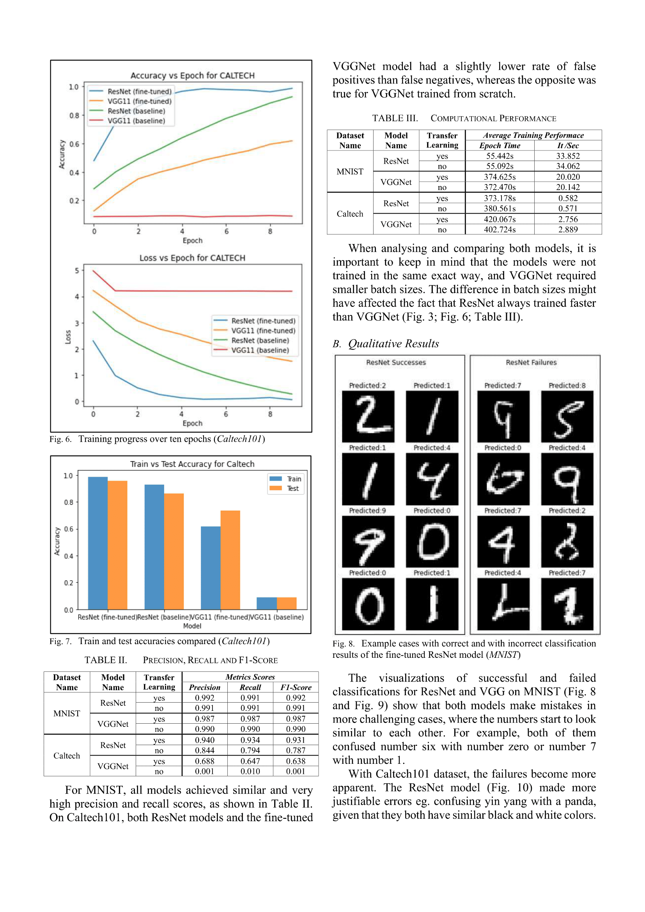

The structure of this project is as follows:
```
├── data/ - all the downloaded datasets are placed inside this folder
│   ├── caltech101/ 
│   └── MNIST/ 
├── dataset/ - all DataLoaders are defined inside this folder
│   ├── caltech101.py 
│   └── mnist.py
├── models/ - all models are defined inside this folder
│   ├── resnet.py
│   └── vgg.py
├── results/ - the results after training are saved here
│   ├── models/
│   └── training/
├── utils/ - contains all the utility code used by train.py and evaluate.ipynb
│   ├── evaluator.py
│   ├── trainer.py
│   └── utils.py
├── evaluate.ipynb - contains code and results for evaluating the trained models
├── README.md
└── train.py - main file for training
```

See my full report [Deeper Networks for Image Classifications.pdf](Deeper-Networks-for-Image-Classifications.pdf) for a complete description and evaluation:

